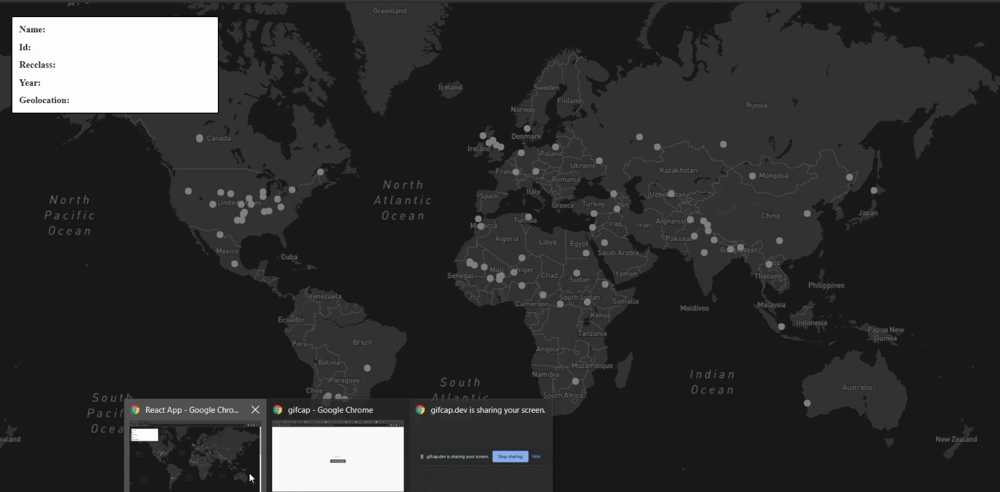

# Meteorite Record

A simple app that displays a list of fallen meteors on Earth from 1900 to present.

This app was created for the MyWallSt - Web Developer Assignment

## Screenshots

## What's inside

*Clicking on the map launches MapBox to display the meteor geolocation
*The chart is filtered by year on the current data
*A table displays all meterorite details(name, nametype, ...) that was sorted by size/ year/ name and filtered from the year 1900
*A search bar by name and year

## Installation

1. Project is created with 
	*ReactJs v17.0.1
	*mapbox v1.12.0
	*chart Js

2. Fonts from [Google Fonts](https://fonts.google.com/specimen/Raleway?sidebar.open=true&selection.family=Raleway:wght@400;500#standard-styles "Google Fonts")

3. Icons from [Heroicons](https://heroicons.dev/ "Heroicons")

## API Reference

It pull data from [NASA's Open Data Portal - Meteorite Landings API](https://data.nasa.gov/view/ak9y-cwf9 "Meteorite Landings API")

